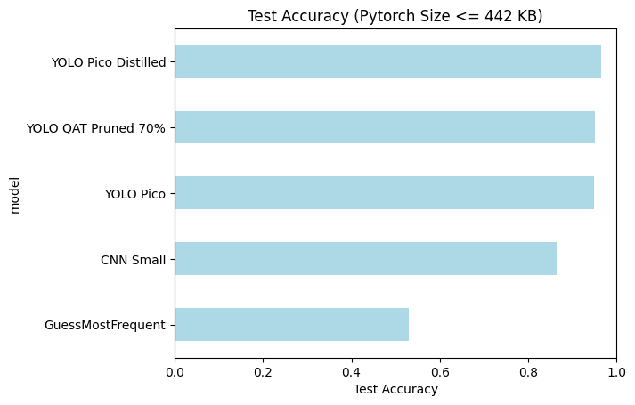
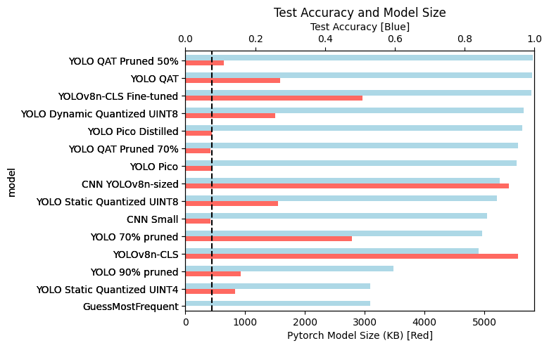
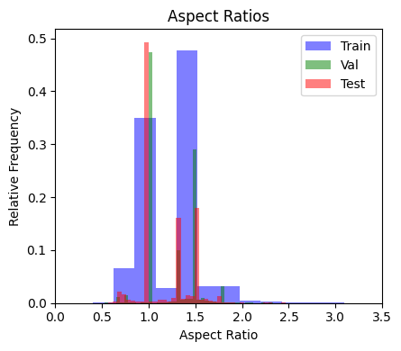
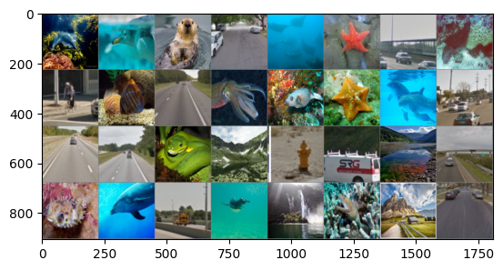
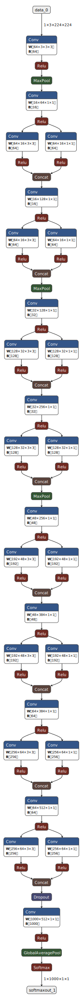

# YOLOv8 Animal Detection for Embedded Systems (YADES)


[](./LICENSE)

Inference and training code to detect whether the camera of an embedded system is looking at an animal or not. The model is fine-tuned from [YOLOv8n-cls](#about-yolov8n-cls) and is optimized for low-power and low-memory use in embedded systems, specifically the [MAX78000 microcontroller](https://github.com/analogdevicesinc/MaximAI_Documentation/blob/main/Guides/MAX78000_Workflow_Guide.md). The MAX78000 has a 442 KB weight limit so quantization, pruning and distillation techniques are used to reduce the model size. For comparison, a shallow 6-layer CNN is also trained with [QAT](#about-quantization-aware-training-qat). An 80-10-10 train-val-test split is applied to [this dataset](https://www.kaggle.com/datasets/tylerelvis/animal-vs-non-animal-image-recognition-dataset) scraped from Google Captcha v2 (34155 images). The dataset is well balanced between animal (18107) and non-animal (16048) images (53% animal vs 47% non-animal).



The best 6-layer CNN model within the size limits achieves 86% accuracy on the test set. The best pruned+quantized YOLOv8n model within the size limits achieves 95% accuracy on the test set thus outperforming the shallow CNN. We can do even better with a dedicated [YOLOv8p](#about-yolov8p) architecture quantized with QAT and trained with distillation learning to achieve 97% accuracy on the test set. An extra advantage of the YOLOv8p architecture is that training is significantly faster (about ~1.5x speedup) compared to the quantized+pruned YOLOv8n. Moreover, it could still be pruned for an extra size reduction at the cost of increased inference and training time.

A number of different approaches with different size/accuracy tradeoffs have been explored. While not useful for the MAX78000, the model sizes are all quite small and may be useful for other embedded systems or edge devices with less strict size constraints.



For baselining purposes, the original pretrained YOLOv8n-cls model's performance is also included (84% test accuracy, 5.8 MB). A similarly-sized (5.4 MB) 6-layer CNN model achieves 90% accuracy on the test set. A simple fine-tuned YOLOv8 model (3.0 MB) achieves 99.1% accuracy on the test set.

Notably, the quantized YOLOv8n model trained with QAT achieves 99.3% test accuracy and actually slightly outperforms the full finetuned model while only requiring 1.6 MB. Pruning the fine-tuned YOLOv8n without quantization requires a lot of pruning to reach a significant decrease in size and thus does not outperform the 6-layer CNN. However pruning and quantizing yields a model that is 99.5% accurate and only requires 0.6 MB!

## Usage

- Check out [notebooks/EDA.ipynb](notebooks/EDA.ipynb) for data exploration and the train-val-test split (80-10-10). 
- Check out [notebooks/Train.ipynb](notebooks/Train.ipynb) for model training and evaluation.

<br>

- Use `python ./scripts/run_cnn.py data/sample.jpg` to run the 6-layer CNNs.
- Use `python ./scripts/run_yolo.py data/sample.jpg` to run the YOLOv8 models.
- Use `python ./scripts/run_onnx.py data/sample.jpg` to run the ONNX exported YOLOv8 models.
- Use `python ./scripts/yolo_pruned.py ./data/sample.jpg` to run the pruned YOLOv8n models.
- Use `python ./scripts/yolo_quantized.py ./data/sample.jpg` to run the quantized YOLOv8n models.
- Use `python ./scripts/yolo_quantprune.py ./data/sample.jpg` to run the quantized+pruned YOLOv8n models.
- Use `python ./scripts/yolo_pico.py inference ./data/sample.jpg` to run the YOLOv8p models.
- Use `python ./scripts/yolo_pico.py train --distilation="yes"` to run the YOLOv8p training script with distillation (use "no" for w/o distillation).  

<br>

- Use `. scripts/MAX78000/train.sh` to train the YOLOv8p model optimized for the MAX78000
    - You can skip if you just want to use the pretrained checkpoint `data/yolo-pico-max78000.pth.tar` (not QAT) or `data/yolo-pico-max78000-qat.pth.tar` (QAT).
    - If you do run training, find your results in [the latest_log_dir](MAX78000/ai8x-training/latest_log_dir).
- Use `. scripts/MAX78000/quantize.sh` to post-training-quantize the YOLOv8p model for the MAX78000
    - You can skip if you just want to use the prequantized checkpoints `data/yolo-pico-max78000-ptq.pth.tar` and `data/yolo-pico-max78000-qat-q.pth.tar`.
- Use `. scripts/MAX78000/eval.sh <checkpoint>` to evaluate the YOLOv8p model on the MAX78000
    - E.g. `. scripts/MAX78000/eval.sh data/yolo-pico-max78000-qat-q.pth.tar`.
    - You can skip if you just want to trust me bro.
- Use `. scripts/MAX78000/synthesize.sh <checkpoint>` to synthesize the YOLOv8p model into C code for the MAX78000
    - E.g. `. scripts/MAX78000/synthesize.sh data/yolo-pico-max78000-qat-q.pth.tar`.
- Use the MSDK to build, flash, and run the model on the MAX78000.
    - Navigate to the C project with `cd MAX78000/ai8x-synthesis/sdk/Examples/MAX78000/CNN/yolo-pico`
    - Use the MSDK to generate the firmware image with `make`
    - Flash the firmware image to the MAX78000

## Setup
Choose one of `Pyenv` or `Conda` to manage your Python environment. Optionally setup development for the MAX78000 if that is your target platform (currently only `Pyenv` is supported with MAX78000 setup).

### With Pyenv

0. `git clone https://github.com/SanderGi/YADES.git`
1. Install Python 3.10.12
    - [Install pyenv](https://github.com/pyenv/pyenv?tab=readme-ov-file#installation)
    - Run `pyenv install 3.10.12`
    - Pyenv should automatically use this version in this directory. If not, run `pyenv local 3.10.12`
2. Create a virtual environment
    - Run `python -m venv ./venv` to create it
    - Run `. venv/bin/activate` when you want to activate it
        - Run `deactivate` when you want to deactivate it
    - Pro-tip: select the virtual environment in your IDE, e.g. in VSCode, click the Python version in the bottom left corner and select the virtual environment
3. Run the commands in './scripts/install.sh', e.g., with `. ./scripts/install.sh`. 
    - This will install dependencies. You should always activate your virtual environment `. ./venv/bin/activate` before running any scripts. 

### With Conda

0. `git clone https://github.com/SanderGi/YADES.git`
1. Install miniconda or anaconda
    - [Install miniconda](https://docs.conda.io/en/latest/miniconda.html)
    - Or [install anaconda](https://docs.anaconda.com/anaconda/install/)
2. Create a virtual environment
    - Run `conda create --prefix ./venv python=3.8.10` to create it
    - Run `conda activate ./venv` when you want to activate it
        - Run `conda deactivate` when you want to deactivate it
    - Pro-tip: select the virtual environment in your IDE, e.g. in VSCode, click the Python version in the bottom left corner and select the virtual environment
3. Run the commands in './scripts/install.sh', e.g., with `. ./scripts/install.sh`. 
    - This will install dependencies. You should always activate your virtual environment `conda activate ./venv` before running any scripts. 

### Additional Instructions for MAX78000 [Optional]
A summary of the MacOS setup instructions from [here](https://github.com/analogdevicesinc/MaximAI_Documentation/blob/main/Guides/MAX78000_Workflow_Guide.md).
Tested on Apple M4 Max running Sequoia 15.1 on January 19, 2025.

- Make sure [Homebrew](https://brew.sh/) is installed
- Make sure you have no virtual environments active, if you do, `deactivate` them
- Update the PICO Debug Adapter firmware
    - [Download the max32625_max78000fthr_if_crc_v1.0.2.bin](https://github.com/analogdevicesinc/MaximAI_Documentation/raw/refs/heads/main/MAX78000_Feather/MAX32625PICO_files/max32625_max78000fthr_if_crc_v1.0.2.bin)
    - Then follow instructions from step 2 [here](https://github.com/analogdevicesinc/MaximAI_Documentation/blob/main/MAX78000_Feather/README.md)
- `mkdir MAX78000 && cd MAX78000`
- `brew install libomp libsndfile tcl-tk sox yamllint`
- Setup training
    - `git clone --recursive https://github.com/analogdevicesinc/ai8x-training.git`
    - `git checkout 1030e842c285cab182a5994e1340103d3bb247be`
    - Patch line 606 of [ai8x.py](MAX78000/ai8x-training/ai8x.py) by replacing it with `hist = histogram(output.clone().detach().flatten().cpu(), bins=2048)`. The extra call to `.cpu()` is necessary with the MPS backend used on Apple Silicon.
    - `cd ai8x-training`
    - Create a virtual environment named `ai8x-training` with Python 3.11.8:
        - Install Python 3.11.8 `pyenv install 3.11.8`
        - Verify Python version with `python --version` and set it if not set automatically `pyenv local 3.11.8`
        - Create a virtual environment `python -m venv ./venv --prompt ai8x-training && echo "*" > venv/.gitignore`
        - Activate the virtual environment `. ./venv/bin/activate`
    - `pip install -U pip wheel setuptools && pip install -r requirements.txt`
    - Deactivate the virtual environment, e.g. `deactivate`
    - `cd ..`
- Setup synthesis
    - `git clone --recursive https://github.com/analogdevicesinc/ai8x-synthesis.git`
    - `git checkout 1411cb1358adae90bd159c42a6be3e605a8db432`
    - `cd ai8x-synthesis`
    - Create a virtual environment named `ai8x-synthesis` with Python 3.11.8:
        - Verify Python version with `python --version` and set it if not set automatically `pyenv local 3.11.8`
        - Create a virtual environment `python -m venv ./venv --prompt ai8x-synthesis && echo "*" > venv/.gitignore`
        - Activate the virtual environment `. ./venv/bin/activate`
    - `pip install -U pip wheel setuptools && pip install -r requirements.txt`
    - Deactivate the virtual environment, e.g. `deactivate`
    - `cd ..`
- `cd ..`
- Setup sdk
    - Take care of [prerequisites](https://analogdevicesinc.github.io/msdk/USERGUIDE/#prerequisites) (should just be installing Homebrew which we already have)
    - Run `brew install libusb-compat libftdi hidapi libusb`
    - [Download the MSDK Installer](https://github.com/analogdevicesinc/msdk/releases)
    - `mkdir ai8x-synthesis/sdk`
    - Run the installer and make sure to set save location to `MAX78000/ai8x-synthesis/sdk`
        - If you get a security alert, [open it anyway](https://support.apple.com/en-us/102445#openanyway)
        - Note, you do not need the micro controller resources other than for the MAX78000. If you deselect the other ones, you'll need to manually click ignore when prompted at the end of the install process to set them up. You also do not need VS-Code integration.
<!-- - Create symlinks
    - `ln -s scripts/MAX78000/animal_dataloader.py MAX78000/ai8x-training/datasets/animal_dataloader.py`
    - `ln -s scripts/MAX78000/yolo_pico.py MAX78000/ai8x-training/models/yolo_pico.py` -->


## Useful Commands

- `pip freeze > requirements.txt` - Save the current environment to a requirements file
- `pip install -r requirements.txt` - Install the requirements from a file

## Folder Structure

```
.
├── .data/                                       # 3rd party data and model weights
├── data/                                        # Sample images, plots, and models
│   ├── yolo-finetune/.../best.pt                  # best YOLOv8n finetune
│   ├── yolo-finetune/.../pico.pt                  # best YOLOv8p w/o distillation
│   ├── yolo-finetune/.../pico_distill.pt          # best YOLOv8p w/ distillation
│   ├── yolo-finetune/.../pruned.pt                # best pruned YOLOv8n
│   ├── yolo-finetune/.../qat.pt                   # best quantized YOLOv8n
│   ├── yolo-finetune/.../qat_pruned.pt            # best quantized+pruned YOLOv8n
│   ├── yolo-finetune/.../dynamic_quantized.onnx   # best quantized YOLOv8n
│   ├── yolo-finetune/.../static_quantized.onnx    # best quantized YOLOv8n
│   ├── animal_cnn_224_small.pt                    # best 6-layer CNN <442KB
│   └── animal_cnn_224.pt                          # best 6-layer CNN
├── MAX78000/                                    # MAX78000 dependencies
├── notebooks/                                   # Training and EDA notebooks
├── scripts/                                     # Model def/inference & install
├── venv/                                        # Virtual python environment
├── .gitignore                                   # Files to ignore in git
├── .python-version                              # Python version for pyenv
├── LICENSE                                      # License file
├── README.md                                    # This file
└── requirements.txt                             # Python dependencies
```

## Limitations

A general limitation is that size reduction below the MAX78000 limits was not attempted. Smaller models could definitely achieve top performance on a simple task like animal detection. A limitation of the pruned models is that in order to realize a size reduction, they store the weights sparsely, however neither Pytorch nor MAX78000 support convolutional layers optimized for sparse vectors so the vectors have to be densified before inference. This is handled efficiently (only the current convolutional layer is densified and then re-sparsified after use to keep memory consumption low), however it does result in a ~1.2x slowdown. This problem is fixed with the tweaked YOLOv8p architecture that does not require pruning to fit within the size requirements while still outperforming the quantized+pruned model. So this is not an overall limitation of the results unlike the below dataset limitations.

The dataset does not take into account the distortions and noise that a typical embedded systems camera might experience. It also does not optimize for the specific aspect ratio the camera might have. The data is mostly common aspect ratios like 1:1 and 3:2, so the model will likely work better for those aspect ratios:



The model in fact handles variable aspect ratios by resizing to 224x224 so if the aspect ratio deviates significantly from 1:1, the model will likely perform much worse. A data augmentation approach to introduce relevant noise and aspect ratio conditions might be useful depending on the task at hand. The images do come at a wide range of resolutions, so the model should be able to handle that. However plotting some sample images resized to 224x224 shows another limitation, namely that the animal images usually have the animal quite close up and near the center:



We can also see that usually the animals are at eye-level and not a lot of the images are from a bird's eye view or from a frog perspective. This might make the model perform worse for use cases such as flight powered sensors or ground-based sensor devices.

## Appendix

### About Quantization Aware Training (QAT)

Unlike Post Training Quantization (PTQ) that quantizes a pre-trained model without retraining, Quantization Aware Training (QAT) runs extra training passes with quantization in mind. This allows the model to adapt to the quantization errors and thus achieve better accuracy. The tradeoff is that it is more resource-intensive since it requires further fine-tuning. It works by simulating the quantization process during the forward pass in training (i.e. round the results after every intermediate operation). This way, the computed error reflects the actual behavior of the model when quantized. Then during the backwards pass, the gradients are computed and the weights updated in full floating precision without quantization. This way they are free to adjust. The derivative of the rounding operation is approximated using the Straight-Through Estimator (STE) and thus assumed to be 1. Finally, once the model is trained, the weights are actually quantized and the simulated quantization/rounding nodes are removed.

### About YOLOv8n-cls

[YOLOv8](https://docs.ultralytics.com/models/yolov8/) is an iteration of the YOLO family of object detection models. YOLOv8n-cls is a variant specifically for classification (cls) with the smallest size (n). It has been pre-trained on [ImageNet](https://docs.ultralytics.com/datasets/classify/imagenet/). YOLO stands for You Only Look Once and is a single-shot end-to-end neural network that unlike a lot of other approaches only uses one pass on the image and only has a single fully connected layer -- the rest is CNN convolutions.



### About YOLOv8p
The smallest officially available YOLOv8 checkpoint is "nano" (see [YOLOv8n](#about-yolov8n-cls)) which is 5.8 MB. We can scale down the layers and channels to fit within the 442 KB limit of the MAX78000. I have named this YOLOv8p for "pico" and the architecture can be found in [scripts/yolo_pico.py](scripts/yolo_pico.py).

## References

- [Dataset](https://www.kaggle.com/datasets/tylerelvis/animal-vs-non-animal-image-recognition-dataset)
- [YOLOv8](https://docs.ultralytics.com/models/yolov8/#performance-metrics)
- [YOLO Image Classification Dataset Format](https://docs.ultralytics.com/datasets/classify/)
- [Quantizing YOLOv8](https://medium.com/@sulavstha007/quantizing-yolo-v8-models-34c39a2c10e2)
- [Pruning YOLOv5](https://docs.ultralytics.com/yolov5/tutorials/model_pruning_and_sparsity/)
- [Model compression techniques](https://kenechiojukwu.medium.com/model-compression-optimization-techniques-for-edge-devices-a-brief-overview-6f27099e431e)
- [Distillation Learning](https://pytorch.org/tutorials/beginner/knowledge_distillation_tutorial.html)
- [MAX78000](https://github.com/analogdevicesinc/MaximAI_Documentation/blob/main/MAX78000_Feather/README.md)
- [MAX78000 Datasheet](https://www.analog.com/en/products/max78000.html)
- [MAX78000 Overview](https://github.com/analogdevicesinc/MaximAI_Documentation/blob/main/Guides/MAX78000_Workflow_Guide.md)
- [MAX78000 Training](https://github.com/analogdevicesinc/ai8x-training)
- [MAX78000 Synthesis](https://github.com/analogdevicesinc/ai8x-synthesis)
- [MAX78000 Hardware Limitations](https://github.com/analogdevicesinc/ai8x-training?tab=readme-ov-file#limitations-of-max78000-networks)
- [MAX78000 Module List](https://github.com/analogdevicesinc/ai8x-training?tab=readme-ov-file#list-of-predefined-modules)
